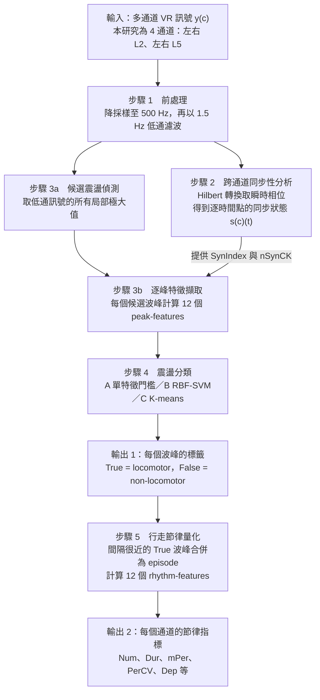

# NOTE｜POCA：以「單一波峰」為分類單位的 CPG 訊號分析演算法

- 整理日期：2026-09-21
- 整理依據：Han et al. (2026) 原始論文全文（Frontiers in Neuroscience, CC BY）。部落格文章只用來對照，不作為內容來源。
- 標示規則：未特別標示的內容皆來自論文。凡是我自己的推論、換算或提醒，一律以「⚠ 整理者註」標出。
- 未讀到的部分：論文的 Supplementary Appendix 1–4（縮寫表、演算法 pipeline、12 個 peak-features 的精確公式、12 個 rhythm-features 的定義）。本筆記的特徵定義依論文正文整理，精確公式需查附錄 3、4。

---

## 0. 摘要

POCA（Peak-based Oscillation Classification Algorithm）處理的是離體新生大鼠脊髓的腹根電訊號。它先把低通濾波後訊號上的每一個局部極大值都當成「候選震盪」，對每個候選波峰量出 12 個特徵，再用分類器判斷該波峰屬於虛擬行走節律（locomotor，True）或不屬於（non-locomotor，False），最後把 True 波峰彙整成節律指標（震盪數、持續時間、平均週期等）。

與常見做法的差別在於分類單位：常見做法把訊號切成固定長度的時段（epoch）再分類，POCA 則是一個波峰一個波峰地分類。

主要結果：用 Protocol A 訓練、在 Protocol B＋C 測試時，只用「波峰顯著度（Pro）」單一特徵做門檻分類，F1 = 0.911；用 6 個特徵的 RBF-SVM，F1 = 0.923。

---

## 1. 論文基本資料

| 項目 | 內容 |
|---|---|
| 題目 | POCA: a CPG signal analysis algorithm using peak-based feature extraction and machine learning |
| 作者 | Xu Han†, Giuliano Taccola†*, Stanislav Culaclii, Atiyeh Mohammadshirazi, Yan-Peng Chen, Wentai Liu*（† 共同第一作者，* 通訊作者） |
| 單位 | UCLA Bioengineering／ECE；SISSA（Trieste）；IMFR（Udine） |
| 期刊 | Frontiers in Neuroscience, vol. 20, 1740554（Sec. Neuroscience Methods and Techniques） |
| 日期 | 2025-11-06 投稿，2026-02-11 接受，2026-03-11 出版 |
| DOI | 10.3389/fnins.2026.1740554 |
| 實作 | 自製 MATLAB 腳本＋Statistics and Machine Learning Toolbox (R2020b) |
| 程式碼 | 論文沒有程式碼可用性聲明，也沒有 repo 連結 |
| 資料 | 原始資料由作者應要求提供 |

---

## 2. 背景與名詞

這一節先把「訊號上的一個波峰到底代表什麼」說清楚，後面才不會混淆。

### 2.1 實驗標本與訊號

- 標本：出生 0–2 天的新生大鼠，取出整個中樞神經系統做離體（in vitro）實驗，共 59 個 preparation。
- 記錄位置：用吸附電極以 DC 模式記錄腹根（ventral root, VR）的胞外訊號，共四個通道：左、右 L2 與左、右 L5。腹根是運動神經元軸突離開脊髓的出口。論文指出 L2 腹根對應屈肌相關指令，L5 腹根對應伸肌相關指令。
- 刺激位置：背根（dorsal root, DR）、薦尾傳入神經或腦幹，依 protocol 而定（見第 6 節）。

### 2.2 CPG 與 fictive locomotion

- CPG（central pattern generator，中央模式產生器）：脊髓內的神經網路，不需要持續的感覺輸入或精確的外部時序訊號，就能產生節律性的運動輸出。
- Fictive locomotion（虛擬行走）：離體標本沒有肢體，不會有任何實際動作。「虛擬行走」指的是腹根送出的運動輸出呈現出行走特有的節律與交替模式，也就是屈肌–伸肌交替、左–右交替。

### 2.3 一次典型的刺激反應（論文 Fig. 1）

1. 基線期（baseline）：尚未刺激。訊號有自發性的低振幅震盪，各通道之間相位同步。
2. 刺激開始（stim onset）。
3. 去極化（depolarization）：刺激開始數秒後，DC 訊號的基線位準快速上升。
4. 行走節律（locomotor rhythm）：在升高的基線上出現峰對峰振幅明顯的震盪，各通道之間呈反相（out-of-phase）。
5. 消退與復極化（repolarization）：即使刺激持續，震盪仍會逐漸減弱並停止，訊號回到基線位準。

### 2.4 本筆記使用的名詞

| 名詞 | 意義 |
|---|---|
| 震盪（oscillation） | 低通後 VR 訊號上的一次慢速起伏，即節律的一個週期。POCA 以波峰（局部極大值）代表一個震盪。 |
| 候選震盪／候選波峰 | 低通訊號上的所有局部極大值，尚未判斷類別。 |
| locomotor 震盪（True） | 屬於虛擬行走節律的震盪。 |
| non-locomotor 震盪（False） | 其餘所有候選波峰，例如基線期的自發性低振幅震盪。 |
| peak-feature | 描述「單一波峰」的特徵，共 12 個。 |
| rhythm-feature | 描述「一個通道整段行走節律」的特徵，共 12 個。 |
| epoch | 把連續訊號切成的固定長度時段。 |

專家標記 True 的準則（論文 3.1）：兩位實驗專家各自獨立標記。訊號若明顯偏離基線且有清楚的節律性，算作震盪事件；若該震盪型態又與其他腹根的訊號呈協調的交替，才歸為 locomotor。

> ⚠ 整理者註：論文對「與哪些腹根交替」的原文是 "alternated with subsequent signals from the homolateral root and exhibited coordinated alternation with corresponding ipsilateral L2 or L5 signals"，用詞有些含糊（homolateral 與 ipsilateral 同義）。一般文獻對虛擬行走的判準是同側 L2–L5 交替加上左右交替。

> ⚠ 整理者註：如果要把 locomotor 震盪連結到真實動作，它大致對應該腹根所支配肌群在一個步態週期中的一次活化。但標本沒有肢體，論文也不使用「step」一詞，因此本筆記一律稱「locomotor 震盪」或「True 波峰」。

---

## 3. POCA 要解的問題

- 輸入：N 個通道的 VR 訊號 y(c)，c = 1 … N。
- 輸出 1：每個通道上每個候選波峰的二元標籤（True／False）。
- 輸出 2：每個通道的 12 個 rhythm-features。
- 動機：調整仿生刺激方案需要大量試驗。目前每一次試驗都由專家挑一條代表性的腹根，人工找出 locomotor 震盪，再計算震盪數、節律持續時間等指標。這個做法耗時，也只看了單一通道。論文指出當時沒有專為 CPG 訊號設計的自動分析演算法。

論文認為 epoch-based 框架不適合 CPG 訊號，理由有三：

1. 同一個 epoch 內可能同時有 locomotor 與 non-locomotor 震盪，epoch 的標籤難以決定。
2. 切成 epoch 之後，彼此獨立的訓練樣本數量有限，可能需要更多實驗才夠訓練。
3. 特徵是從整個 epoch 算出的區域性統計量，對單一震盪事件的描述不夠直接。

改以波峰為單位後，每筆紀錄本身就含有許多彼此獨立的震盪，樣本數足夠，標籤也直接對應到專家實際標記的對象。

---

## 4. POCA 流程圖

文字版（Mermaid 無法顯示時使用）：

| 步驟 | 輸入 | 處理 | 輸出 |
|---|---|---|---|
| 1 前處理 | 原始訊號 y(c) | 降採樣至 500 Hz；1.5 Hz 低通 | 低通訊號 |
| 2 同步性分析 | 各通道低通訊號 | Hilbert 轉換取瞬時相位；比較通道間相位差 | 每個通道逐時間點的同步狀態 s(c)(t) |
| 3a 候選偵測 | 低通訊號 | 找出所有局部極大值 | 候選波峰清單 |
| 3b 特徵擷取 | 候選波峰＋s(c)(t)＋刺激時間 | 計算 12 個 peak-features | 每個通道一個特徵矩陣（特徵數 × 候選數） |
| 4 分類 | 特徵矩陣 | 門檻法、RBF-SVM 或 K-means | 每個候選波峰的 True／False |
| 5 節律量化 | True 波峰 | 合併成 episode；計算 rhythm-features | 每個通道 12 個節律指標 |

步驟 2 與步驟 3a 都只需要步驟 1 的輸出，彼此不相依，兩者的結果在步驟 3b 匯合。

---

## 5. 各步驟的邏輯

### 5.1 步驟 1：前處理

- 各 protocol 的原始取樣率不同，統一降採樣到 500 Hz。
- 以 1.5 Hz 做低通濾波。本研究設定的 CPG 行走頻帶為 0.15–1.5 Hz，高於此頻帶的成分對判斷行走節律沒有幫助。論文提醒這個頻帶在不同實驗間可能略有差異。

> ⚠ 整理者註：論文沒有說明濾波器的種類、階數，以及是否使用零相位濾波。

### 5.2 步驟 2：跨通道同步性分析

目的：行走節律成立時，各通道之間應為反相；基線期的自發震盪則是同步。因此「這個波峰發生時，各通道是否同步」是判斷 locomotor 的依據之一。

做法：

1. 對每個通道的低通訊號做 Hilbert 轉換，取出瞬時相位 φ(c)(t)。
2. 在每個時間點判斷通道 c 是否處於同步狀態：通道 c 與其他通道的相位差小於 45° 時，s(c)(t) = True。
3. 前提：資料中至少要有一對通道呈現左右交替或屈伸交替的波形，這項分析才能進行。

> ⚠ 整理者註：正文寫的是與 "any other channels" 的相位差小於 45°，但公式 (2) 用的是 ∀i（對所有其他通道都成立）。兩者意思不同，重現時應以公式為準，或向作者確認。另外，公式沒有寫出相位差的環繞處理（例如 −179° 與 +179° 實際只差 2°）。

### 5.3 步驟 3a：候選震盪偵測

取低通訊號的所有局部極大值。這一步不做任何篩選，所有篩選都留給步驟 4 的分類器。

### 5.4 步驟 3b：12 個 peak-features

#### 顯著度（Pro）與寬度（Wid）的計算方式

CPG 訊號是非平穩的：去極化會把整段基線抬高。因此不能直接用絕對振幅代表震盪強度，論文改在局部參考窗內估計顯著度：

1. 以待分析的波峰為中心，取 ±6.67 秒的參考窗。6.67 秒等於 1／0.15 Hz，也就是行走頻帶中最慢節律的一個週期。
2. 在窗內分別往左、往右找到最近的、比自己高的波峰，以此界定左、右兩個搜尋區間。
3. 在左、右區間內各取訊號的最低點，稱為區間最小值。
4. 兩個區間最小值中，取較高的那一個作為參考位準。
5. Pro = 波峰振幅 − 參考位準。
6. Wid = 訊號在「半個 Pro」高度處，左右兩個交點之間的時間距離。

論文的說法是：在局部近似平穩的參考窗內計算顯著度，比使用絕對振幅、或在整段非平穩訊號上估計顯著度，更準確也更穩健。

> ⚠ 整理者註：步驟 2–5 與地形學的 topographic prominence、MATLAB `findpeaks` 的 prominence、SciPy `peak_prominences` 是同一個定義，POCA 的差別在於把搜尋範圍限制在局部窗內（SciPy 以 `wlen` 參數提供同樣的限制）。論文沒有說明窗內找不到更高波峰時如何處理；上述函式的做法是把搜尋區間延伸到窗的邊界。

#### 特徵一覽

| 名稱 | 類別 | 定義（依論文正文） | True 與 False 的分布差異（論文 4.1） |
|---|---|---|---|
| Time | 基本 | 波峰的發生時間 | True 波峰較少出現在紀錄的最前段與最後段：前段刺激尚未引發節律，後段節律已消退 |
| Amp | 基本 | 波峰的絕對振幅 | 兩類差異很小，因為不同紀錄、不同通道的基線位準差異很大 |
| Pro | 基本 | 峰頂減去局部參考位準，反映震盪強度 | True 較高；與專家標籤的相關係數 0.68 |
| Wid | 基本 | 半顯著度高度處的時間寬度 | True 較高 |
| Pro2Dep | 相對顯著度 | Pro 相對於訊號的去極化位準 | True 較高；與專家標籤的相關係數 0.75，為 12 個特徵中最高 |
| Pro2Base | 相對顯著度 | Pro 相對於基線期震盪的平均 Pro | True 較高；相關係數 0.60 |
| Pro2Wid | 相對顯著度 | Pro 相對於 Wid | True 較高 |
| LocDev | 區域特徵 | 此波峰的 Pro 與時間上相鄰四個波峰（前二、後二）的 Pro 之間的偏差 | True 較高 |
| SynIndex | 跨通道 | 波峰前後 0.4 秒窗內，s(c)(t) 為 True 的時間百分比。數值越大，代表此時與其他通道的相位越接近 | 兩類的多數波峰都是 0，但 True 為 0 的比例顯著更高 |
| StimCK | 布林 | 此震盪是否發生在刺激開始之後 | True 幾乎全為真 |
| FreqCK | 布林 | 此震盪的頻率是否落在行走頻帶內 | True 幾乎全為真 |
| nSynCK | 布林 | SynIndex 是否小於 50%（即非同步） | 論文未單獨描述 |

補充：

- SynIndex 的實例（論文 Fig. 2B）：在去極化剛開始的第 8 秒，SynIndex 為 65%；第 9 秒 CPG 建立交替相位關係後，降為 0%。
- 12 個特徵在兩類之間的平均差異檢定，p 值皆小於 10⁻⁶。布林特徵用卡方檢定，其餘用 t 檢定。
- 特徵之間的相關：所有顯著度相關特徵與 Wid 彼此高度相關，因為定義互相依賴。三個布林特徵各自是另一個連續特徵的二值化（FreqCK 對 Wid、StimCK 對 Time、nSynCK 對 SynIndex）。Amp 與顯著度類特徵正相關，Time 與顯著度類特徵負相關，意思是顯著度高的震盪通常發生得較早，而且疊在去極化之上所以絕對振幅也較大。
- 特徵在每個通道內先做正規化，才進行後續計算。

> ⚠ 整理者註：Pro2Dep、Pro2Base、Pro2Wid 在正文中只說是把 Pro 與另一個量「比較」，從命名看應為比值，確切公式在附錄 3。正規化的方法（例如 z-score 或 min–max）正文未說明。

### 5.5 步驟 4：三種分類方法

輸入是每個通道的特徵矩陣，輸出是每個候選波峰的 True／False。

**方法 A：單一特徵門檻法**

- 規則：某個正規化後的特徵值大於門檻 τ，就判為 True。
- 訓練：讓 τ 從該特徵的最小值掃到最大值，取訓練資料上 F1 最高的 τ。
- 12 個特徵各自建立一個門檻模型，共 12 個。

**方法 B：RBF 核 SVM**

- 使用多個特徵。RBF 核可處理非線性的分類邊界。
- 規則：決策函數 Σ αᵢ cᵢ K(xᵢ, x) + b 大於 0 就判為 True，其中 K 為 RBF 核，xᵢ 為支持向量，cᵢ 為其類別。
- 共測試 1,024 個模型，每個模型使用 12 個特徵的不同子集。

> ⚠ 整理者註：12 個特徵的全部子集應有 2¹² = 4,096 個，而 1,024 = 2¹⁰，可見並非 12 個特徵都自由組合。細節在附錄 3。

**方法 C：K-means 分群（非監督式，作為對照基準）**

- 分成兩群。候選波峰離哪一群的中心較近，就歸到哪一群。
- 平均顯著度較高的那一群指定為 True。
- 使用與最佳 SVM 相同的特徵集。
- 目的：不使用標籤，檢驗這組特徵本身是否就具有兩群的結構。

### 5.6 步驟 5：行走節律量化

- 一次成功的 CPG 反應（完整的去極化到復極化）通常包含一個 locomotor episode。把間隔很近的 True 波峰合併，得到 episode。若有外部介入，節律也可能包含多個相隔較遠的 episode。
- 對每個通道計算 12 個 rhythm-features。論文列出常用的五個：

| 名稱 | 意義 |
|---|---|
| Num | locomotor 震盪的數目 |
| Dur | 行走節律的持續時間 |
| mPer | locomotor 震盪的平均週期 |
| PerCV | 週期的變異係數，反映節律的規則程度 |
| Dep | 訊號的去極化幅度 |

其餘七個（出現在論文 Table 4）：AUC、Duty、mWid、WidCV、mPro、ProCV、mLocDev。定義見附錄 4。

> ⚠ 整理者註：合併的間距門檻，論文寫作 "<2. 5= 1/0.15Hz"。但 1／0.15 Hz 等於 6.67 秒，與 2.5 對不上，看起來是排版錯誤，實際數值需向作者確認。

---

## 6. 資料與實驗設計

### 6.1 資料集

三個子資料集來自三種彼此獨立的刺激方式：

| Protocol | 刺激方式 | 紀錄數 | 候選震盪數 | True | False |
|---|---|---|---|---|---|
| A | 刺激薦尾傳入神經（37.5–160 μA，脈寬 0.1 ms，2 Hz） | 41 | 13,076 | 3,038 | 10,038 |
| B | 刺激右側 L6 或 S1 背根，矩形脈衝串 80 秒（7.5–40 μA，0.1 ms，2 Hz） | 14 | 5,123 | 1,477 | 3,646 |
| C | 點狀刺激腦幹的延腦腹外側區 80 秒（500–4,500 μA，1–5 ms，1–2 Hz） | 4 | 1,732 | 413 | 1,319 |

- 紀錄長度 79–120 秒，平均 116.1 ± 10.7 秒。
- 每個通道的震盪數 59–154，平均 103.3 ± 15.6。
- True 對 False 的比例在各紀錄間為 0–1.1，平均 0.37 ± 0.19。類別不平衡，因此論文以 F1 作為特徵選擇的準則。

> ⚠ 整理者註：三個 protocol 的紀錄數加總為 59，與 preparation 數相同，推測每個 preparation 對應一筆紀錄。若如此，以紀錄為單位切分訓練集與測試集，就等於以不同動物切分。

### 6.2 實驗 1：特徵選擇與初步評估（只用 Protocol A）

1. 41 筆中隨機保留 9 筆作為測試集。
2. 其餘 32 筆平均分成四組，做四折交叉驗證：每次 24 筆訓練、8 筆驗證。
3. 以四折的平均驗證 F1，分別選出最佳的門檻模型（12 選 1）與最佳的 SVM 特徵集（1,024 選 1）。
4. 用選出的特徵集與全部 32 筆重新訓練，在 9 筆測試集上評估。
5. K-means 使用最佳 SVM 的特徵集，同樣評估。

### 6.3 實驗 2：跨 protocol 的泛化能力

1. 沿用實驗 1 選出的特徵集，用 Protocol A 全部 41 筆重新訓練。
2. 在 Protocol B 與 C 共 18 筆上測試。

### 6.4 評估指標

- 分類：sensitivity、precision、accuracy、F1。
- 節律量化：以專家標籤算出的 rhythm-features 為基準，與各方法的結果計算 ICC（intraclass correlation coefficient）。

---

## 7. 結果

### 7.1 最佳特徵

- 門檻法：最佳單一特徵是 Pro，交叉驗證的驗證 F1 = 0.886 ± 0.112。排名其後的是 Pro2Dep、Pro2Base、Pro2Wid。
- SVM：最佳特徵集為 {Pro, Wid, Time, SynIndex, FreqCK, LocDev}，驗證 F1 = 0.915 ± 0.105。

### 7.2 分類表現（平均 ± 標準差）

實驗 1，測試集（Protocol A 保留的 9 筆）：

| 方法 | Precision | Sensitivity | Accuracy | F1 |
|---|---|---|---|---|
| 門檻法（Pro） | 0.866 ± 0.190 | 0.886 ± 0.078 | 0.942 ± 0.040 | 0.861 ± 0.122 |
| SVM | 0.912 ± 0.158 | 0.900 ± 0.073 | 0.958 ± 0.035 | 0.898 ± 0.106 |
| K-means | 0.688 ± 0.176 | 0.910 ± 0.102 | 0.890 ± 0.051 | 0.774 ± 0.147 |

實驗 2，測試集（Protocol B＋C，18 筆）：

| 方法 | Precision | Sensitivity | Accuracy | F1 |
|---|---|---|---|---|
| 門檻法（Pro） | 0.916 ± 0.146 | 0.929 ± 0.073 | 0.957 ± 0.040 | 0.911 ± 0.129 |
| SVM | 0.947 ± 0.135 | 0.919 ± 0.080 | 0.965 ± 0.034 | 0.923 ± 0.127 |
| K-means | 0.763 ± 0.216 | 0.947 ± 0.124 | 0.896 ± 0.095 | 0.824 ± 0.195 |

實驗 2 的 F1，依 protocol 分開：

| 方法 | Protocol B（14 筆） | Protocol C（4 筆） |
|---|---|---|
| 門檻法（Pro） | 0.911 ± 0.066 | 0.914 ± 0.246 |
| SVM | 0.933 ± 0.062 | 0.888 ± 0.242 |
| K-means | 0.795 ± 0.169 | 0.924 ± 0.247 |

解讀：

- SVM 整體最佳；只用 Pro 的門檻法已經相當接近。
- K-means 的 sensitivity 最高但 precision 最低，代表它把過多的波峰判成 True。論文據此說明監督式學習的優勢，同時指出這組特徵本身已有明顯的兩群結構。
- 監督式方法的表現依序為：交叉驗證訓練 > 交叉驗證驗證 > 測試集 1，屬於常見現象。獨立的測試集 2 表現與測試集 1 相當。

> ⚠ 整理者註：摘要寫 SVM 的 accuracy 為 0.966，Table 3 與 4.2.3 節的數字是 0.965 ± 0.034，兩者略有出入。另外，測試集 2 中 False 佔 4,965／6,855 = 72.4%，也就是全部判為 False 也有 72.4% 的 accuracy，所以 accuracy 不適合作為這個資料集的主要指標。

### 7.3 節律量化與專家的一致性（ICC，實驗 2 測試集）

| 特徵 | SVM | 門檻法 | K-means |
|---|---|---|---|
| Num | 0.81 | 0.69 | 0.32 |
| mPer | 0.88 | 0.90 | 0.84 |
| PerCV | 0.40 | 0.34 | 0.36 |
| Dur | 0.81 | 0.75 | 0.00 |
| Dep | 0.97 | 0.96 | 0.83 |
| AUC | 0.92 | 0.89 | 0.69 |
| Duty | 0.94 | 0.93 | 0.84 |
| mWid | 0.96 | 0.96 | 0.91 |
| WidCV | 0.66 | 0.50 | 0.41 |
| mPro | 0.98 | 0.98 | 0.86 |
| ProCV | 0.80 | 0.74 | 0.50 |
| mLocDev | 0.92 | 0.91 | 0.85 |

- SVM 在 12 個特徵中有 11 個的 ICC 為三種方法中最高（mPer 由門檻法最高）。
- 論文的歸類：6 個特徵 ICC > 0.9（Dep、Duty、mWid、AUC、mPro、mLocDev），4 個介於 0.75 與 0.9 之間（Num、mPer、Dur、ProCV）。
- 一致性最低的是兩個變異係數：PerCV（0.40）與 WidCV（0.66）。

> ⚠ 整理者註：變異係數類的指標對少數波峰的誤判較敏感，這可能是 PerCV、WidCV 的 ICC 偏低的原因。論文本身沒有討論這一點。

### 7.4 不同 protocol 表現差異的解釋（論文 5.1）

論文用 KL divergence 衡量訓練集（Protocol A）與測試集的特徵分布差異，數值越接近 0 代表分布越相似：

| 比較 | Pro | Wid | Time | SynIndex | FreqCK | LocDev | 平均 |
|---|---|---|---|---|---|---|---|
| A 對 B | 5.27E-07 | 5.27E-07 | 1.91E-03 | 6.62E-02 | 4.31E-03 | 2.93E-04 | 1.21E-02 |
| A 對 C | 2.25E-07 | 2.25E-07 | 9.54E-01 | 1.99E-01 | 2.61E-01 | 1.68E-02 | 2.38E-01 |

- 單看 Pro，Protocol C 與訓練集比 B 更相似。只用 Pro 的門檻法在 C 上的 F1（0.914）也略高於 B（0.911）。
- 把 SVM 用到的六個特徵一起看，Protocol C 與訓練集的差異明顯大於 B。SVM 在 B 上的 F1（0.933）也明顯高於 C（0.888）。
- 論文的結論：KL divergence 無法解釋所有差異，但可用來預估模型在新資料上的表現，協助挑選與目標資料較相似的訓練資料。

### 7.5 需要多少標記資料（論文 5.2）

- 做法：把 Protocol A 分成五組輪流當測試集 1，從其餘資料中隨機抽取 1 到 30 筆紀錄作為訓練集，每個訓練規模重複 10 次，並同時在測試集 2（B＋C）上評估。
- 結果：訓練筆數增加時，訓練表現略降、兩個測試集的表現上升，反映小訓練集的過擬合逐漸減輕。測試表現大約在訓練規模達到 10 筆紀錄時趨於穩定，但各指標與各次重複之間仍有變異。K-means 不受訓練規模影響。
- 論文的建議：套用到新資料時，優先使用以訊號特性相近的資料訓練出的模型；若沒有，就在新資料上標記少量震盪，用已選定的特徵重新訓練。論文也提醒這個數字高度依賴資料集本身的變異程度。

> ⚠ 整理者註：這裡的單位是「紀錄」而不是「波峰」。Protocol A 平均每筆紀錄約有 320 個候選波峰（13,076 ÷ 41），10 筆紀錄約等於 3,000 個已標記的波峰。

### 7.6 peak-based 與 epoch-based 的適用情境（論文 5.3）

- 震盪的判別依賴波峰形態時（例如電刺激誘發的虛擬行走），peak-based 框架有優勢，因為它能直接描述單一波峰的局部特性。
- 分析重點是「一串震盪的爆發」時（例如癲癇發作紀錄或 HFO），epoch-based 框架也能有不錯的結果，因為 epoch 特徵能描述區域特性（例如一段能量隆起）。
- peak-based 框架也可以納入區域特徵，LocDev 就是一例，而且它確實提升了 SVM 的表現。
- 論文對 HFO 偵測、EEG 癲癇偵測的說法是「有潛在應用可能」，本研究沒有在這些資料上做任何測試。

---

## 8. 限制與使用時的注意事項

論文自己指出的：

- 模型的泛化能力取決於訓練資料與目標資料的特徵分布是否相似（見 7.4）。
- 建議的最小訓練規模只適用於本資料集，換資料集需重新評估。
- 行走頻帶（0.15–1.5 Hz）在不同實驗間可能略有不同。
- 同步性分析需要至少一對呈現交替波形的通道。

⚠ 整理者註（以下為我的判讀）：

- Protocol C 只有 4 筆紀錄，各指標的標準差很大（F1 的標準差約 0.24），針對 C 的結論應保守看待。
- StimCK、Time、Pro2Base、Pro2Dep 這幾個特徵預設了「先有基線期、再給刺激、隨後去極化」的實驗流程。若要用在沒有明確刺激時間點的自發性節律，這些特徵需要移除或重新定義。
- Pro 需要波峰之後 6.67 秒的訊號，LocDev 需要之後兩個波峰，兩者都用到未來的資料。目前的設計屬於離線分析；若要即時運作，必須修改特徵或接受數秒的延遲。
- 資料全部來自新生大鼠的離體標本，論文沒有在活體動物或人類資料上驗證。
- 論文未說明的實作細節：濾波器規格、特徵正規化方法、SVM 超參數的設定方式、窗內找不到更高波峰時的處理。程式碼未公開，完整重現需要補上這些細節或詢問作者。
- 論文內部的三處不一致：episode 合併門檻的數值（5.6）、同步狀態定義的 any 與 ∀（5.2）、accuracy 的 0.966 與 0.965（7.2）。

---

## 9. 部落格文章與論文不一致之處

對照對象：《尋找脊髓裡的「節拍器」：AI 如何幫我們解開走路的秘密？》（神經妙算，2026-09-21）。

| 部落格的說法 | 論文的內容 |
|---|---|
| 「只給 AI 看 10 個範例」就能表現得跟看了幾百個範例一樣好 | 訓練規模的單位是「紀錄」。約 10 筆紀錄時測試表現趨於穩定，相當於約 3,000 個已標記波峰。論文同時提醒仍有變異，且結論依資料集而定。 |
| 小節標題「AI 真的比人準嗎？」 | 論文的標準答案就是兩位專家的人工標記。所有指標衡量的是「與專家的一致程度」，在這個設計下無法得出比專家更準的結論。論文的用語是結果與專家評估相當接近。 |
| 強調「準確度高達 96.6%」 | 0.966 出自摘要，Table 3 為 0.965 ± 0.034。資料類別不平衡（測試集 2 中 False 佔 72.4%），論文用來選模型的指標是 F1（SVM 為 0.923）。 |
| POCA「可以幫助醫生從混亂的腦波中快速抓出發作的前兆」、HFO 分析「正好能派上用場」 | 論文只說 peak-based 框架對這些應用有潛在可能，沒有任何測試。論文在討論中還指出，這類以爆發為主的訊號用 epoch-based 框架也能有不錯的結果。 |
| 「把在 A 老鼠身上訓練好的模型，直接搬到 B 老鼠身上，準確度可能會稍稍下降」 | 論文分析的是跨「刺激 protocol」的差異，並以特徵分布的 KL divergence 解釋。訓練集與測試集本來就以紀錄為單位切分（推測即不同動物）。 |
| 未來可「即時監控神經的反應，並自動調整電擊的強弱與節奏」 | 論文沒有提到即時或閉迴路應用。論文的定位是離線、大規模分析離體實驗資料，以協助調整仿生刺激方案。依目前的特徵設計，即時運作還需要修改（見第 8 節）。 |
| 傳統方法「例如每 5 秒一段」 | 論文沒有給出 epoch 的具體長度。 |
| 術語「內省性 (Interpretable)」 | Interpretable 一般譯為「可解釋性」。論文的意思是特徵具有生理意義，因此分類依據可以被人理解。 |

---

## 10. 自行重現時可用的現成函式（⚠ 整理者補充，非論文內容）

| 步驟 | MATLAB | Python |
|---|---|---|
| 降採樣 | `resample`、`decimate` | `scipy.signal.resample_poly`、`scipy.signal.decimate` |
| 1.5 Hz 低通 | `lowpass`，或 `butter` 搭配 `filtfilt` | `scipy.signal.butter` 搭配 `sosfiltfilt` |
| 瞬時相位 | `hilbert`、`angle` | `scipy.signal.hilbert`、`numpy.angle` |
| 候選波峰、Pro、Wid | `findpeaks`（`'WidthReference','halfprom'`） | `scipy.signal.find_peaks`、`peak_prominences(wlen=…)`、`peak_widths(rel_height=0.5)` |
| RBF-SVM | `fitcsvm(…,'KernelFunction','rbf')` | `sklearn.svm.SVC(kernel='rbf')` |
| K-means | `kmeans(X, 2)` | `sklearn.cluster.KMeans(n_clusters=2)` |

重現時需要注意：

- SciPy 的 `wlen` 是以波峰為中心的「整個窗長」，單位為取樣點。±6.67 秒在 500 Hz 下約為 6,670 點。
- 計算相位差時要先環繞到 −180° 至 +180° 再取絕對值。
- 低通訊號保留了去極化造成的 DC 漂移。直接做 Hilbert 轉換時，瞬時相位可能受漂移影響。論文沒有提到是否先去除趨勢，重現時應檢查。
- LocDev、SynIndex、Pro2Dep、Pro2Base、Pro2Wid、三個布林特徵以及 12 個 rhythm-features 需要自行撰寫，定義見論文的 Supplementary Appendix 3 與 4。

---

## 11. 參考資料

### 主要來源

1. Han, X., Taccola, G., Culaclii, S., Mohammadshirazi, A., Chen, Y.-P., & Liu, W. (2026). POCA: a CPG signal analysis algorithm using peak-based feature extraction and machine learning. *Frontiers in Neuroscience*, 20, 1740554. https://doi.org/10.3389/fnins.2026.1740554
   - PMC 全文：https://pmc.ncbi.nlm.nih.gov/articles/PMC13013536/
   - 授權：CC BY 4.0
   - 通訊作者：Giuliano Taccola (taccola@sissa.it)、Wentai Liu (wentai@ucla.edu)

### 對照用（非內容來源）

2. 林樂瑞 (2026-09-21)。尋找脊髓裡的「節拍器」：AI 如何幫我們解開走路的秘密？《神經妙算》，國立清華大學羅中泉老師實驗室。https://neuroinfo-cclolab.blogspot.com/2026/09/ai.html

### 論文引用、與本筆記內容直接相關的文獻

3. Marchetti, C., Beato, M., & Nistri, A. (2001). Alternating rhythmic activity induced by dorsal root stimulation in the neonatal rat spinal cord in vitro. *J. Physiol.*, 530, 105–112. https://doi.org/10.1111/j.1469-7793.2001.0105m.x （背根電刺激誘發虛擬行走）
4. Taccola, G. (2011). The locomotor central pattern generator of the rat spinal cord in vitro is optimally activated by noisy dorsal root waveforms. *J. Neurophysiol.*, 106, 872–884. https://doi.org/10.1152/jn.00170.2011 （仿生刺激波形；人工分析流程）
5. Dose, F., Menosso, R., & Taccola, G. (2013). Rat locomotor spinal circuits in vitro are activated by electrical stimulation with noisy waveforms sampled from human gait. *Physiol. Rep.*, 1, e00025. https://doi.org/10.1002/phy2.25
6. Dose, F., & Taccola, G. (2016). Two distinct stimulus frequencies delivered simultaneously at low intensity generate robust locomotor patterns. *Neuromodulation*, 19, 563–575. https://doi.org/10.1111/ner.12402
7. Mohammadshirazi, A., Apicella, R., Zylberberg, B. A., Mazzone, G. L., & Taccola, G. (2023). Suprapontine structures modulate brainstem and spinal networks. *Cell. Mol. Neurobiol.*, 43, 2831–2856. https://doi.org/10.1007/s10571-023-01321-z （本研究標本的製備方法）
8. Taccola, G., Margaryan, G., Mladinic, M., & Nistri, A. (2008). Kainate and metabolic perturbation mimicking spinal injury differentially contribute to early damage of locomotor networks in the in vitro neonatal rat spinal cord. *Neuroscience*, 155, 538–555. https://doi.org/10.1016/j.neuroscience.2008.06.008 （L2／L5 腹根記錄）
9. Mor, Y., & Lev-Tov, A. (2007). Analysis of rhythmic patterns produced by spinal neural networks. *J. Neurophysiol.*, 98, 2807–2817. https://doi.org/10.1152/jn.00740.2007 （脊髓節律訊號的分析方法與頻帶）
10. Harris-Warrick, R. (2013). Locomotor pattern generation in the rodent spinal cord. In *Encyclopedia of Computational Neuroscience*. Springer. https://doi.org/10.1007/978-1-4614-7320-6_48-1
11. Marder, E., & Calabrese, R. L. (1996). Principles of rhythmic motor pattern generation. *Physiol. Rev.*, 76, 687–717. https://doi.org/10.1152/physrev.1996.76.3.687 （CPG 的一般原理）
12. Staba, R. J., Wilson, C. L., Bragin, A., Fried, I., & Engel, J. (2002). Quantitative analysis of high-frequency oscillations (80–500 Hz) recorded in human epileptic hippocampus and entorhinal cortex. *J. Neurophysiol.*, 88, 1743–1752. https://doi.org/10.1152/jn.2002.88.4.1743 （epoch／能量式 HFO 偵測的代表）
13. Siddiqui, M. K., Morales-Menendez, R., Huang, X., & Hussain, N. (2020). A review of epileptic seizure detection using machine learning classifiers. *Brain Informatics*, 7, 5. https://doi.org/10.1186/s40708-020-00105-1 （epoch-based 機器學習框架的回顧）
14. Koo, T. K., & Li, M. Y. (2016). A guideline of selecting and reporting intraclass correlation coefficients for reliability research. *J. Chiropr. Med.*, 15, 155–163. https://doi.org/10.1016/j.jcm.2016.02.012 （ICC 的判讀標準）
15. Csiszar, I. (1975). I-divergence geometry of probability distributions and minimization problems. *Ann. Probab.*, 3, 146–158. https://doi.org/10.1214/aop/1176996454 （KL divergence）

### 第 10 節提到的函式文件

16. MathWorks. `findpeaks` — Signal Processing Toolbox documentation. https://www.mathworks.com/help/signal/ref/findpeaks.html
17. SciPy. `scipy.signal.peak_prominences`. https://docs.scipy.org/doc/scipy/reference/generated/scipy.signal.peak_prominences.html
18. SciPy. `scipy.signal.peak_widths`. https://docs.scipy.org/doc/scipy/reference/generated/scipy.signal.peak_widths.html
